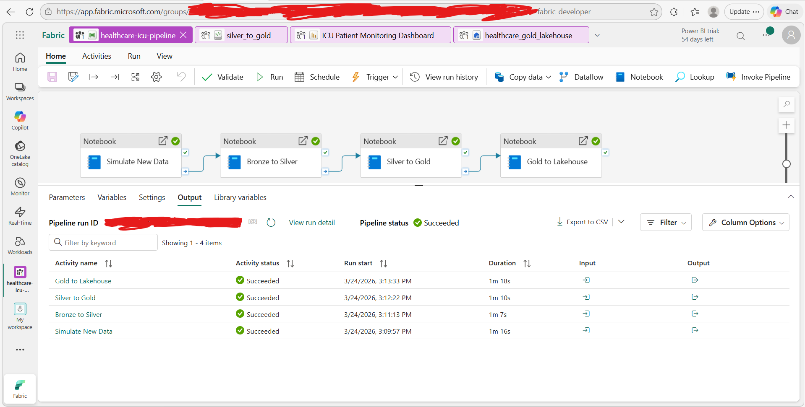
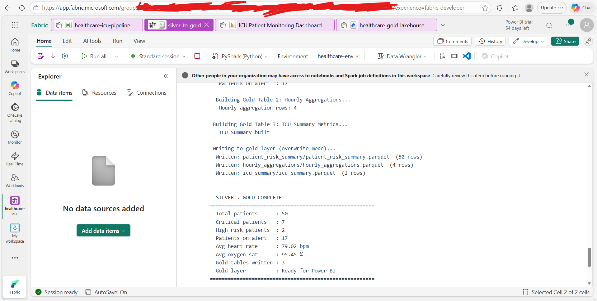
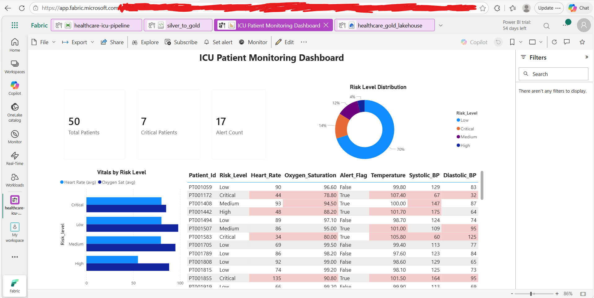
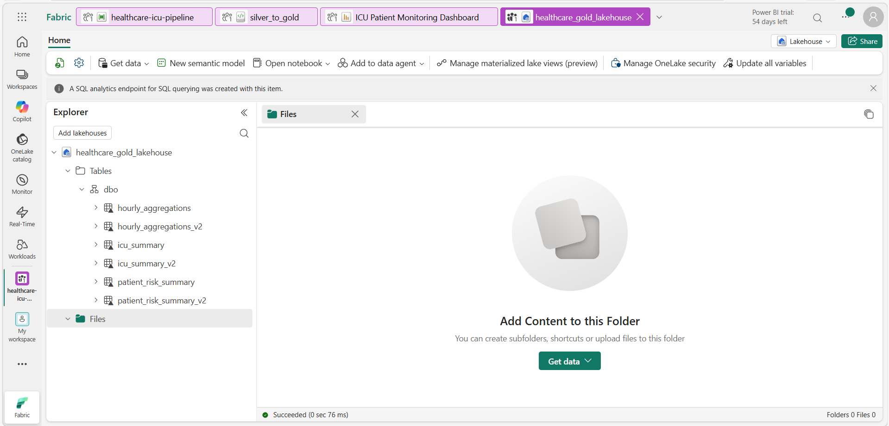
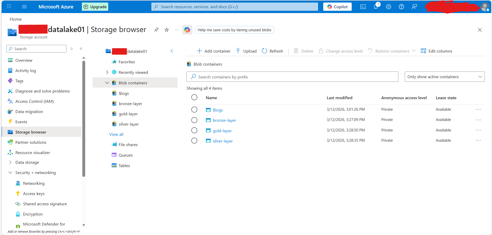

# 🏥 Real-Time ICU Patient Monitoring Data Platform


An end-to-end real-time healthcare data engineering platform that simulates ICU patient vital signs monitoring, processes data through a **Medallion Architecture** (Bronze/Silver/Gold), and delivers clinical insights via a **Power BI dashboard** hosted on **Microsoft Fabric**.

---

## 🏗️ Architecture
```
Microsoft Fabric Pipeline (Scheduled Daily 7PM)
        ↓
01_simulate_new_data (Fabric Notebook)
        ↓ 50 ICU patient JSON files
Bronze Layer — ADLS Gen2 (bronze-layer container)
        ↓ 02_bronze_to_silver (Fabric Notebook)
Silver Layer — ADLS Gen2 (silver-layer container, Parquet)
        ↓ 03_silver_to_gold (Fabric Notebook)
Gold Layer — ADLS Gen2 (gold-layer container, Parquet)
        ↓ 04_gold_to_lakehouse (Fabric Notebook)
Microsoft Fabric Lakehouse — Delta Tables
        ↓ Direct Lake Semantic Model
Power BI Dashboard — ICU Patient Monitoring Dashboard
```

---

## ⚙️ Pipeline Scripts

| Script | Description |
|--------|-------------|
| `01_simulate_new_data.py` | Generates 50 realistic ICU patient vitals daily and streams to Azure Event Hub and Bronze layer |
| `02_bronze_to_silver.py` | Reads latest Bronze partition, applies data quality checks, clinical range validation, and writes clean Parquet to Silver layer |
| `03_silver_to_gold.py` | Applies NEWS-based clinical risk scoring, computes patient risk levels, hourly aggregations, and ICU summary metrics |
| `04_gold_to_lakehouse.ipynb` | Loads Gold Parquet files into Microsoft Fabric Lakehouse as Delta tables for Power BI consumption |

---

## 🏥 Clinical Risk Scoring

Risk levels are calculated using a **NEWS (National Early Warning Score)**-inspired algorithm across 6 vital parameters:

| Vital Sign | Normal Range | Alert Threshold |
|------------|-------------|-----------------|
| Heart Rate | 60–100 bpm | < 60 or > 100 |
| Oxygen Saturation | ≥ 95% | < 95% |
| Temperature | 97–100.4°F | < 97 or > 100.4 |
| Systolic BP | 90–140 mmHg | < 90 or > 140 |
| Diastolic BP | 60–90 mmHg | < 60 or > 90 |
| Respiratory Rate | 12–20 /min | < 12 or > 20 |

**Risk Levels:** Low | Medium | High | Critical

---

## 📊 Power BI Dashboard

The dashboard is hosted on **Microsoft Fabric** and refreshes automatically after each pipeline run via scheduled orchestration.

**Visuals:**
- KPI Cards: Total Patients, Critical Patients, Alert Count
- Donut Chart: Risk Level Distribution
- Bar Chart: Average Vitals by Risk Level
- Patient Table: Individual vitals with conditional clinical threshold formatting

---

## 🛠️ Tech Stack

| Layer | Technology |
|-------|-----------|
| Data Generation | Python, Faker, Azure Event Hub |
| Storage | Azure Data Lake Storage Gen2 |
| Processing | Python, Pandas, PyArrow |
| Orchestration | Microsoft Fabric Pipeline (scheduled daily) |
| Serving | Microsoft Fabric Lakehouse, Delta Lake |
| Visualization | Power BI (Direct Lake mode) |
| CI/CD | Azure DevOps *(coming soon)* |

---

## 🚀 How to Run

1. **Clone the repo**
```bash
git clone https://github.com/Syed-Shoaib08/azure-healthcare-icu-platform.git
```

2. **Install dependencies**
```bash
pip install azure-eventhub azure-storage-blob pandas pyarrow faker
```

3. **Configure credentials** — replace placeholders in each script:
```python
STORAGE_CONNECTION_STR = "YOUR_AZURE_STORAGE_CONNECTION_STRING"
```

4. **Run pipeline in order:**
```bash
python 01_simulate_new_data.py
python 02_bronze_to_silver.py
python 03_silver_to_gold.py
# Run 04_gold_to_lakehouse.ipynb in Microsoft Fabric
```

---

## 📁 Project Structure
```
azure-healthcare-icu-platform/
├── 01_simulate_new_data.py      # Data generation & Event Hub streaming
├── 02_bronze_to_silver.py       # Bronze → Silver transformation
├── 03_silver_to_gold.py         # Silver → Gold aggregation & risk scoring
├── 04_gold_to_lakehouse.ipynb   # Gold → Fabric Lakehouse Delta tables
└── README.md
```

---

## ⚠️ Security Note

All credentials and connection strings have been removed from this repository.
Never commit real Azure credentials to version control.
Use **Azure Key Vault** or **environment variables** in production.

---

## 📸 Screenshots

### Pipeline Execution — All 4 Notebooks Succeeded


### Silver to Gold — Clinical Risk Scoring Output


### Power BI Dashboard — ICU Patient Monitoring


### Microsoft Fabric Lakehouse — Delta Tables


### Azure ADLS Gen2 — Medallion Architecture Storage

